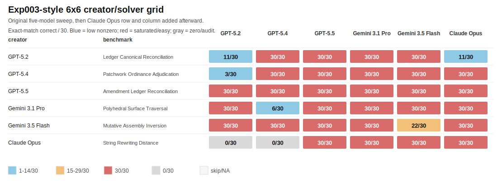
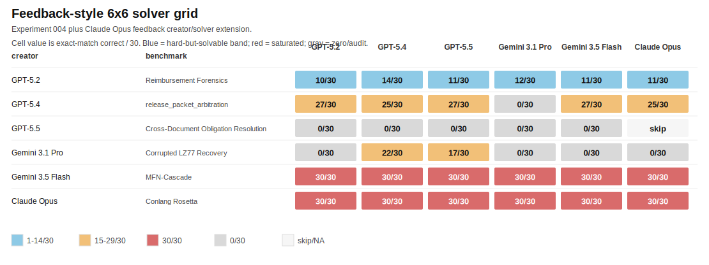

# BenchBench

BenchBench is an experiment in evaluating models as benchmark inventors.

The object is not simply to make a task that frontier models fail. The object
is to make a benchmark package that is valid, reproducible, human-auditable,
hard under strong solver attempts, and useful as a measurement axis.

## Core Loop

1. A creator model builds a complete benchmark package.
2. The package is validated for generation, solver-bundle isolation, scoring,
   and leakage.
3. Solver models attack the public solver bundle with tools.
4. Easy benchmarks are rejected.
5. Benchmarks must be externally solvable in principle from the public solver
   bundle; impossible, under-specified, or private-keyed tasks do not count.
6. Benchmarks that nobody can solve are flagged for solvability audit, not
   automatically accepted.
7. Surviving candidates are compared against existing evals using rank
   correlations and regression predictability.

BenchBench itself is the system. Individual generated benchmarks are candidate
artifacts inside that system; there is no single "current live candidate."

## Benchmark Bank And Run Modes

BenchBench can use generated benchmarks in two ways:

- **Stable bank:** keep a saved set of benchmark packages fixed, then add new
  solver models against the same public solver bundles. This is the cheapest
  way to compare a new model family against prior OpenAI solver results.
- **Fresh creator sweep:** ask current models to create new benchmark packages,
  validate them, then run the solver grid. Strong new candidates can be promoted
  into the stable bank for later solver extensions.

Current status: there is not yet a final promoted stable bank. Experiment 002
is a historical stable-bank reference because it was the first fixed set that
we extended with Gemini solver columns. The current headline evidence is the
two five-model sweeps, Experiments 003 and 004. Experiment 004's Reimbursement
Forensics is the strongest current candidate for audit and possible promotion.

## Methodology And Process

BenchBench treats benchmark creation as the thing being evaluated. The model is
not asked to answer a fixed task. It is asked to invent a complete benchmark
package that other models can later attempt under controlled conditions.

Each creator run produces a self-contained candidate directory with a public
solver bundle and private evaluation files. A valid package has:

- `generator.py`: builds a deterministic sample from a seed.
- `verifier.py`: checks that public items and private gold answers match the
  required contract.
- `scorer.py`: grades solver predictions against private gold answers.
- `gold_private_sample.jsonl`: private answers for the 30-item sample.
- `solver_bundle/`: the only directory a solver is allowed to see.
- `validation_report.md` and `failure_modes.md`: creator-side explanation of
  solvability, leakage checks, and known weaknesses.

The controller then validates the candidate before scoring it. It regenerates
the sample, runs the verifier, self-scores the gold answers, runs a shifted-wrong
control, checks that the solver bundle exists, and scans the public bundle for
obvious leakage such as answer keys or private file names. Invalid candidates
are repaired once by the same creator model, then validated again.

Solvers are run blind. They receive only the isolated `solver_bundle/` copy and
the instruction to return JSONL rows of `{"id":"...","answer":"..."}`. The
controller extracts matching prediction rows and scores them with the
candidate's scorer. Missing rows, malformed rows, wrong item ids, and timeouts
all count against the solver.

BenchBench can also run a feedback loop. After a sweep, we write a short
failure report that names what broke: near-perfect solver scores, all-zero
solvability warnings, model-specific collapses, timeouts, parse failures, and
obvious shortcut strategies. The next creator sweep can receive that report as
extra context. This tests whether models can improve their benchmark-invention
strategy after seeing how the previous candidates failed.

The basic acceptance logic is conservative:

- If many strong solvers get high scores, the candidate is too easy.
- If every solver gets zero, the candidate is not automatically good; it needs a
  solvability and identifiability audit.
- A useful benchmark should be externally solvable in principle, hard for
  strong tool-enabled models, reproducible, auditable, and meaningfully
  different from existing evals.

The stable-bank workflow keeps candidate packages fixed and adds new solver
columns. That is how the Gemini results were added: the OpenAI-created
Experiment 002 candidates stayed unchanged, and Antigravity/Gemini solvers were
run against the same public bundles and private scorers.

## Current Results

The current headline evidence is Experiments 003 and 004: two full five-model
creator/solver sweeps across GPT-5.2, GPT-5.4, GPT-5.5, Gemini 3.1 Pro, and
Gemini 3.5 Flash. Claude Opus has now been added as an extension creator and
solver. Experiment 004 is still the most important run because it tested
whether creators could improve after seeing the failure report from Experiment
003.

Experiments 001 and 002 are historical support. They explain why the prompt was
broadened, how the Gemini backend was smoke-tested against fixed benchmark
packages, and what failure modes to avoid. They are not the main result.

### Full 6x6 Result Set

The current full result set is a reconstructed 6x6 grid: the two original
five-model sweeps plus Claude Opus creator and solver extension runs. It is
reconstructed rather than simultaneous because Claude was added after the
five-model sweeps had already run.

Full tables and notes:
`experiments/result_grids_6x6_20260523.md`.





The short read: Reimbursement Forensics is still the only current candidate
with the shape BenchBench wants. All six solvers land in the low nonzero band,
from 10/30 to 14/30. The Claude-created benchmarks do not change the winner:
String Rewriting Distance had a scorer type-strictness artifact and was solved
30/30 by four solvers; Conlang Rosetta was solved 30/30 by all six.

Claude's feedback-style creator run did receive the Experiment 003 failures,
the Experiment 004 audit, and Claude's own first-run failure. It did not receive
the completed 6x6 grids because they did not exist yet. The next creator sweep
should use `experiments/feedback_for_next_full_6x6_sweep_20260523.md`, which
packages the full current evidence.

### Experiment 003: First Five-Model Sweep

This run used all five models as both creators and solvers. All five generated
packages passed controller validation after the score parser was fixed to accept
common scorer outputs such as `{"score": 30, "total": 30}` and `30/30`.

Full artifact:
`experiments/003_five_model_sweep_20260522_195526/summary.md`.

| creator | generated benchmark | solver GPT-5.2 | solver GPT-5.4 | solver GPT-5.5 | solver Gemini 3.1 Pro | solver Gemini 3.5 Flash | status |
|---|---|---:|---:|---:|---:|---:|---|
| GPT-5.2 | Ledger Canonical Reconciliation | 11/30 | 30/30 | 30/30 | 30/30 | 30/30 | too easy |
| GPT-5.4 | Patchwork Ordinance Adjudication | 3/30 | 30/30 | 30/30 | 30/30 | 30/30 | too easy, but diagnostic |
| GPT-5.5 | Amendment Ledger Reconciliation | 30/30 | 30/30 | 30/30 | 30/30 | 30/30 | too easy |
| Gemini 3.1 Pro | Polyhedral Surface Traversal | 30/30 | 6/30 | 30/30 | 30/30 | 30/30 | too easy, but diagnostic |
| Gemini 3.5 Flash | Mutative Assembly Inversion | 30/30 | 30/30 | 30/30 | 30/30 | 22/30 | too easy |

The useful signal here is not a new accepted benchmark. It is model-specific
failure. GPT-5.2 did poorly on Patchwork Ordinance Adjudication while every
other solver got 30/30. GPT-5.4 did poorly on Polyhedral Surface Traversal while
every other solver got 30/30. Gemini Flash missed rows and scored 22/30 on its
own Mutative Assembly Inversion benchmark, but the stronger solvers solved it
perfectly. Under the current acceptance rule, none of these fresh candidates
should be promoted to the stable bank yet.

### Experiment 004: Feedback-Driven Five-Model Sweep

This run gave all five creators the outside-in benchmark landscape plus the
Experiment 003 failure report. The prompt said, in effect: your last benchmarks
were breakable; make one that is still externally solvable but survives those
solver strategies.

Full artifact:
`experiments/004_feedback_sweep_20260522_225208/summary.md`.

Solvability audit:
`experiments/004_feedback_sweep_20260522_225208/solvability_audit.md`.

| creator | generated benchmark | solver GPT-5.2 | solver GPT-5.4 | solver GPT-5.5 | solver Gemini 3.1 Pro | solver Gemini 3.5 Flash | status |
|---|---|---:|---:|---:|---:|---:|---|
| GPT-5.2 | Reimbursement Forensics (ReiFor) | 10/30 | 14/30 | 11/30 | 12/30 | 11/30 | best current candidate; audit next |
| GPT-5.4 | release_packet_arbitration | 27/30 | 25/30 | 27/30 | 0/30 | 27/30 | mostly too easy; Gemini Pro failure is diagnostic |
| GPT-5.5 | Cross-Document Obligation Resolution | 0/30 | 0/30 | 0/30 | 0/30 | 0/30 | scoring-contract failure |
| Gemini 3.1 Pro | Corrupted LZ77 Recovery | 0/30 | 22/30 | 17/30 | 0/30 | 0/30 | solvable but too narrow/operationally brittle |
| Gemini 3.5 Flash | MFN-Cascade | 30/30 | 30/30 | 30/30 | 30/30 | 30/30 | too easy |

The strongest result was GPT-5.2's Reimbursement Forensics benchmark. Every
solver recovered some answers, so it does not look purely unknowable, but no
solver got close to saturation. That is the shape BenchBench is looking for.
It should be audited for leakage, answer evidence, and human solvability before
being promoted to the stable bank.

The post-run audit changed the interpretation of two rows. GPT-5.5's
Cross-Document Obligation Resolution was not a clean all-zero benchmark:
solvers recovered all 30 notification dates, but the scorer required exact
private labels for `evidence_codes` and categorical values that the public
packet did not enumerate. That makes it an under-specified answer-contract
failure, not a keeper. Gemini 3.1 Pro's Corrupted LZ77 Recovery is not
unsolvable: GPT-5.4 solved 22/30 and GPT-5.5 solved 17/30. Its weak cells are
mostly blank outputs, no parsed rows, or timeout behavior.

### Claude Opus Extension

Claude Opus was tested after the five-model sweeps. Antigravity Claude Opus
worked for small print-mode calls, but the full creator attempt through
Antigravity produced no files after a long wait, so the full extension used
native Claude Code Opus. Native Claude reports cost and cache telemetry.

Claude Opus creator runs:

| pass | generated benchmark | full solver result | result |
|---|---|---|---|
| Exp003-style starting prompt | String Rewriting Distance | 0, 0, 30, 30, 30, 30 | reject; scorer type artifact plus saturation |
| feedback-style prompt | Conlang Rosetta | 30, 30, 30, 30, 30, 30 | reject; saturated |

The full solver result order is GPT-5.2, GPT-5.4, GPT-5.5, Gemini 3.1 Pro,
Gemini 3.5 Flash, Claude Opus.

Artifacts:

- `experiments/005_claude_opus_exp003_style_20260523_125019/`
- `experiments/006_claude_opus_feedback_style_20260523_125611/`
- `experiments/result_grids_6x6_20260523.md`
- `experiments/feedback_for_next_full_6x6_sweep_20260523.md`

Claude Opus as solver on Experiment 003:

| creator | benchmark | Claude Opus |
|---|---|---:|
| GPT-5.2 | Ledger Canonical Reconciliation | 11/30 |
| GPT-5.4 | Patchwork Ordinance Adjudication | 30/30 |
| GPT-5.5 | Amendment Ledger Reconciliation | 30/30 |
| Gemini 3.1 Pro | Polyhedral Surface Traversal | 30/30 |
| Gemini 3.5 Flash | Mutative Assembly Inversion | 30/30 |

Claude Opus as solver on Experiment 004:

| creator | benchmark | Claude Opus |
|---|---|---:|
| GPT-5.2 | Reimbursement Forensics | 11/30 |
| GPT-5.4 | release_packet_arbitration | 25/30 |
| GPT-5.5 | Cross-Document Obligation Resolution | skipped; scoring-contract failure |
| Gemini 3.1 Pro | Corrupted LZ77 Recovery | 0/30; stopped after extended operational stall |
| Gemini 3.5 Flash | MFN-Cascade | 30/30 |

Interpretation: Claude Opus did not create a keeper in these two attempts. It
did strengthen the solver evidence. Reimbursement Forensics remains the best
current candidate because Opus also landed in the low nonzero band at 11/30.
MFN-Cascade and the Claude-created candidates are too easy. Corrupted LZ77
remains more of an operationally brittle technical-recovery task than a clean
broad reasoning benchmark.

### Historical Support: Experiments 001 And 002

These runs are worth keeping as evidence, but they should be read as archive
material behind the two 5x5 runs.

Experiment 001 was the first complete 3-model grid. It was useful because it
showed a visual/topology attractor in the early prompt.

| creator | generated benchmark | solver GPT-5.2 | solver GPT-5.4 | solver GPT-5.5 | status |
|---|---|---:|---:|---:|---|
| GPT-5.2 | Folded Strip Order | 16/30 | 14/30 | 19/30 | too easy |
| GPT-5.4 | Occluded Tile Provenance | 7/30 | 4/30 | 5/30 | difficulty pass in pilot |
| GPT-5.5 | Shadow Weave Topology | 15/30 | 24/30 | 26/30 | too easy |

Experiment 002 removed the visual/domain nudge and became the first fixed
reference set for adding Gemini solver columns.

| creator | generated benchmark | benchmark type | solver GPT-5.2 | solver GPT-5.4 | solver GPT-5.5 | status |
|---|---|---|---:|---:|---:|---|
| GPT-5.2 | IgnoreSense | `.gitignore` semantics / software spec following | 4/30 | 7/30 | 7/30 | hard under tested solvers; novelty unmeasured |
| GPT-5.4 | Spectrum Assembly | constrained string reconstruction | 30/30 | 30/30 | 30/30 | too easy |
| GPT-5.5 | Protocol Archaeology | trace-based byte-protocol inference | 0/30 | 0/30 | 0/30 | hard under tested solvers; solvability unresolved |

Gemini solver extension on Experiment 002:

| benchmark | Gemini 3.1 Pro (High) | Gemini 3.5 Flash (High) |
|---|---:|---:|
| IgnoreSense | 7/30 | 4/30 |
| Spectrum Assembly | 30/30 | 30/30 |
| Protocol Archaeology | 0/30 | 0/30 (timeout; 0 predictions) |

Protocol Archaeology remains a cautionary case: all-zero scores can mean the
task is under-specified, not that the benchmark found a deep missing capability.

## What We Think We Learned

- The broad prompt is better than the visual-attractor prompt: it produced
  software-spec, combinatorial, and trace-inference benchmarks instead of three
  visual puzzles.
- Adding Gemini through Antigravity did not change the basic ranking:
  IgnoreSense remains hard but nonzero, Spectrum Assembly is still too easy,
  and Protocol Archaeology is still an all-zero warning case.
- The fresh five-model sweep validated the full Codex plus Antigravity harness:
  all five models can act as creators and solvers, and selected Gemini model
  labels are checked per call.
- The five fresh benchmarks did not produce a new stable-bank keeper. Each was
  solved at 30/30 by at least one strong solver.
- The fresh run still produced useful diagnostic cases: Patchwork Ordinance
  Adjudication exposed a GPT-5.2 weakness, and Polyhedral Surface Traversal
  exposed a GPT-5.4 weakness. These are not benchmark acceptances, but they are
  good leads for future creator prompts.
- Feedback helped. In Experiment 003 every fresh candidate was solved at 30/30
  by at least one solver. In Experiment 004, GPT-5.2 created a candidate where
  all six tested solvers, including Claude Opus, scored between 10/30 and
  14/30.
- Claude Opus did not create a stronger benchmark in these two attempts. Its
  first task collapsed to an obvious search problem, and its feedback task was
  solved perfectly by every solver.
- Feedback did not solve the whole problem. One candidate was still saturated
  at 30/30, one all-zero row turned out to be an under-specified scoring
  contract, and two had split results that require audit before they can be
  treated as useful measurements.
- All-zero scores need forensic follow-up. GPT-5.5's row looked impossible in
  the grid, but the saved predictions showed all solvers solved the due-date
  part and were zeroed by hidden answer vocabulary choices.
- A benchmark can fail by being too easy: Spectrum Assembly looked formal, but
  every solver got 30/30 once the right search abstraction was obvious.
- A benchmark can also fail by being too unknowable: Protocol Archaeology may
  be private-keyed or under-specified from the solver packet.
- The right acceptance gate is not "frontier model got less than 50%." It is:
  externally solvable, well-specified, reproducible, hard under strong solver
  attempts, and then useful as a measurement axis.
- Similarity/novelty still needs more model coverage. The current data is
  enough for a smoke test, not a serious regression claim.

## Current Useful Artifacts

- `benchmark_landscape/`: researched eval catalog, public score tables, model
  score matrix, and similarity method.
- `run_broad_three_model_sweep.py`: creator/solver sweep harness, now with
  Codex, Antigravity, and Claude Code model backends.
- `run_existing_solver_extension.py`: adds extra solver columns to an existing
  saved sweep without regenerating creator packages.
- `run_broad_xhigh_sanity.py`: extra high-effort solver sanity harness.
- `experiments/001_three_model_grid_pilot/`: historical 3-model pilot.
- `experiments/002_broad_sweep_20260515_220653/`: historical 3-model broad
  sweep and initial fixed-reference set for Gemini solver extension.
- `experiments/003_five_model_sweep_20260522_195526/`: first full five-model
  creator/solver sweep with GPT and Gemini models.
- `experiments/004_feedback_sweep_20260522_225208/`: feedback-driven
  five-model creator/solver sweep.
- `experiments/005_claude_opus_exp003_style_20260523_125019/`: Claude Opus
  creator run with the Exp003-style starting prompt.
- `experiments/006_claude_opus_feedback_style_20260523_125611/`: Claude Opus
  creator run with feedback from prior failures and the first Claude run.
- `experiments/result_grids_6x6_20260523.md`: reconstructed full 6x6 result
  grids and generated heatmaps.
- `experiments/feedback_for_next_full_6x6_sweep_20260523.md`: feedback packet
  for the next all-model creator sweep.
- `experiments/claude_opus_extension_20260523.md`: concise Claude Opus creator
  and solver extension summary.

## Running A Sweep

```bash
python run_broad_three_model_sweep.py
```

The creator prompt reads `benchmark_landscape/creator_prompt_landscape_pack.md`
when present, plus the Experiment 001 pilot summary.

To include a specific Antigravity/Gemini model in a fresh creator and solver
sweep, pass an Antigravity model spec:

```bash
python run_broad_three_model_sweep.py \
  --models gpt-5.2 gpt-5.4 gpt-5.5 agy:gemini-3.1-pro agy:gemini-3.5-flash-high
```

To give creator models a prior failure report, pass it as feedback context:

```bash
python run_broad_three_model_sweep.py \
  --feedback-context experiments/003_five_model_sweep_20260522_195526/feedback_for_next_sweep.md \
  --models gpt-5.2 gpt-5.4 gpt-5.5 agy:gemini-3.1-pro agy:gemini-3.5-flash-high
```

To include Claude as a creator and solver in the normal symmetric grid, add a
Claude model spec:

```bash
BENCHBENCH_CLAUDE_MAX_BUDGET_USD=25 python run_broad_three_model_sweep.py \
  --feedback-context experiments/feedback_for_next_full_6x6_sweep_20260523.md \
  --models gpt-5.2 gpt-5.4 gpt-5.5 agy:gemini-3.1-pro agy:gemini-3.5-flash-high claude:opus
```

Claude can also be called through Antigravity:

```bash
python run_broad_three_model_sweep.py \
  --models gpt-5.2 gpt-5.4 gpt-5.5 agy:gemini-3.1-pro agy:gemini-3.5-flash-high agy:claude-opus-4.6-thinking
```

Current Claude Code status:

- BenchBench uses native Claude Code calls, not Antigravity, for Claude specs.
- `claude:sonnet`, `claude:opus`, and `claude:haiku` map to
  `claude -p --model ... --output-format json`.
- The runner writes the JSON `result` field to the normal output file and keeps
  the full Claude JSON in the `.stdout.txt` sidecar.
- Claude JSON reports `total_cost_usd`, `modelUsage`, cache creation tokens,
  and cache read tokens. BenchBench records those fields in the manifest and
  summary tables.
- `BENCHBENCH_CLAUDE_MAX_BUDGET_USD` caps each Claude Code call. The default is
  `$25` per call unless overridden.
- Native Claude Code prompt caching is preserved by using normal print-mode
  calls and stdin prompts. Repeated calls record cache-read tokens when Claude
  reuses cached prompt/system context.
- The creator prompt keeps the large stable context before volatile artifact
  paths so repeated Claude creator calls can reuse more of the prefix cache.

Current Antigravity status:

- `agy --print` works for non-interactive creator and solver calls.
- The public print-mode help does not expose a per-call `--model` flag.
- BenchBench makes specific Antigravity calls by temporarily setting
  `~/.gemini/antigravity-cli/settings.json` for one `agy --print` call, then
  restoring the original settings file.
- The runner verifies the selected model label in the Antigravity log before
  accepting the result.
- `agy:gemini-3.1-pro` selects `Gemini 3.1 Pro (High)`.
- `agy:gemini-3.5-flash-high` selects `Gemini 3.5 Flash (High)`.
- `agy:claude-sonnet-4.6-thinking` selects `Claude Sonnet 4.6 (Thinking)`.
- `agy:claude-opus-4.6-thinking` selects `Claude Opus 4.6 (Thinking)`.
- The Claude Antigravity labels were smoke-tested on 2026-05-23 with exact
  print-mode responses and selected-model log checks.
- Antigravity-Claude is usable for grid parity, but the current Antigravity
  path does not report Claude `total_cost_usd` or cache-read tokens. Native
  Claude Code is the better path when cost and caching telemetry matter.
- Antigravity terminal tools open in a global scratch directory by default, so
  the creator and solver prompts include the exact artifact or isolated bundle
  path and instruct the model to use that path for all file and shell work.

## Adding Solvers To The Existing Sweep

The stable-bank path is to keep existing benchmark packages fixed and add new
models as extra solver columns:

```bash
python run_existing_solver_extension.py --solver agy:gemini-3.5-flash-high
```

To add Gemini 3.1 Pro:

```bash
python run_existing_solver_extension.py --solver agy:gemini-3.1-pro
```

To add Claude Sonnet as an extra solver column on a saved run:

```bash
BENCHBENCH_CLAUDE_MAX_BUDGET_USD=25 python run_existing_solver_extension.py \
  --run-root experiments/004_feedback_sweep_20260522_225208 \
  --solver claude:sonnet
```

## Similarity / Novelty Check

```bash
python scripts/score_benchmark_similarity.py \
  --target-benchmark benchbench_ignoresense \
  --out benchmark_landscape/similarity_ignoresense_smoke.md
```

The current local solver set is too small for serious regression novelty
claims. The method is ready; the data is not yet broad enough.
