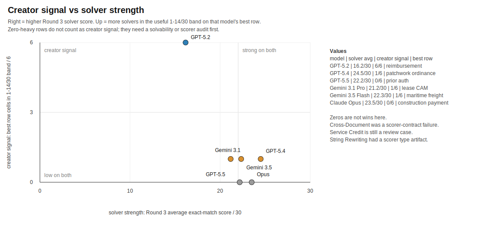

# BenchBench

BenchBench asks whether a model can write a benchmark that other strong models
cannot simply clear.

Each creator model writes a complete benchmark package: public solver files,
private gold answers, generator, verifier, scorer, and notes on expected
failure modes. Solver models get only the public bundle and answer 30 items.

The target is a task strong agents can work through, score exactly, and still
not finish.

## Why this matters for AI evaluation

Most public benchmarks eventually saturate: strong models learn the pattern and
scores cluster near the ceiling. BenchBench tests a different skill — **can a
model design a task that is hard-but-fair for other strong models?** That maps
directly to AI eval, red-teaming, and benchmark design work: separating genuine
capability gaps from broken scorers, leakage, or all-or-nothing failure modes.

## Current Result

**GPT-5.2 leads as a benchmark creator.**

Its best candidate is **Reimbursement Forensics**, from Experiment 004. Across
six solvers, it scored **10/30, 14/30, 11/30, 12/30, 11/30, and 11/30**.

That is the best shape we have seen: every solver made progress, every solver
stalled, and the row held up across GPT-5.2, GPT-5.4, GPT-5.5, Gemini 3.1 Pro,
Gemini 3.5 Flash, and Claude Opus.

Round 3 produced two good challengers. Gemini 3.1 Pro's **Commercial Lease CAM
Reconciliation** spread solvers from **1/30 to 26/30**. Gemini 3.5 Flash's
**Maritime Freight & Customs Audit** spread solvers from **4/30 to 25/30**.
Both are useful. Neither beat Reimbursement Forensics, because the best solvers
got too far.


## Creator vs Solver

The creator and solver signals split. GPT-5.2 has the strongest creator result
and the weakest latest solver average. GPT-5.4 and Claude Opus look strong as
solvers, but their created tasks mostly became too easy.

This chart does not reward `0/30` rows as "hard." It counts only low-nonzero
solver cells, because all-zero rows can be unsolvable, underspecified, or
scorer-broken.



## Best Rows

| read | benchmark | creator | score shape | what it shows |
|---|---|---|---|---|
| Current leader | Reimbursement Forensics | GPT-5.2 | 10-14/30 across all six solvers | The cleanest hard-but-solvable shape so far. |
| Round 3 challenger | Commercial Lease CAM Reconciliation | Gemini 3.1 Pro | 1-26/30 | Strong solver separation; high top-end scores. |
| Round 3 challenger | Maritime Freight & Customs Audit | Gemini 3.5 Flash | 4-25/30 | Strong solver separation; high top-end scores. |
| Diagnostic row | Corrupted LZ77 Recovery | Gemini 3.1 Pro | 0-22/30 | Useful stress signal; narrow and brittle. |

## What Made The Hard Tasks Hard

The best candidates looked like real paperwork: reimbursement claims, lease
charges, freight records, service credits, royalties, prior authorization, and
construction payments.

They were hard because the evidence was visible but annoying. A solver had to
track dates, exceptions, arithmetic, thresholds, and rounding inside one
record. No single fact was magical. The work was in holding the whole packet
together.

GPT-5.2 did this best. Reimbursement Forensics used ordinary evidence and exact
totals, then stacked enough exceptions to slow every solver.

Gemini 3.1 Pro and Gemini 3.5 Flash found the best Round 3 surfaces, especially
leases and freight. Their tasks separated solvers well. Top solvers reached
25/30 and 26/30.

GPT-5.4 and GPT-5.5 built plausible operational tasks that strong solvers often
reduced to checklist work. Claude Opus built clean contest-style packages; in
these runs, clean usually meant easy.

## Completion Rate

Completion rate is the average exact-match score across solvers. Read it with
one more number: how many solvers landed in the useful **1-14/30** band.


Reimbursement Forensics sits in the target zone: **38%** average completion and
six useful low-nonzero solver cells. Commercial Lease CAM and Maritime Freight
sit farther right: they separated solvers, while the best solvers completed too
much. Service Credit and Cross-Document Obligation sit at the bottom left: low
completion with no useful solver cells.

## What BenchBench Measures

BenchBench turns model evaluation into a design problem.

A strong creator has to choose the task, package the evidence, define exact
answers, hide the gold data, and build a scorer that rewards the intended work.
Then strong solvers attack the public bundle with tools.

So BenchBench asks a different question: which model understands failure well
enough to write the next hard test?

Right now, the answer is GPT-5.2. The next sweep asks whether another model can
learn from the current grid and beat Reimbursement Forensics.

## Reading The Grids

Rows are benchmark creators. Columns are solvers. Cells are exact-match scores
out of 30.

- High scores mean the benchmark was too easy.
- Low nonzero scores are the target band.
- Zero-heavy rows get inspected; they often reveal packet or scorer problems.

Canonical grids and notes:
[`experiments/canonical/README.md`](experiments/canonical/README.md)

The canonical results page also includes the round-by-round creator trajectory,
the latest solver leaderboard, and Round 3 matchup summaries.

## Next Run

First review the known scorer and solvability cases:
[`experiments/review_queue.md`](experiments/review_queue.md)

Then run a challenger sweep. GPT-5.2 keeps the Reimbursement Forensics row as
the incumbent. The other creators try to beat it against the full six-model
solver panel.

```bash
BENCHBENCH_CLAUDE_MAX_BUDGET_USD=25 python run_broad_three_model_sweep.py \
  --feedback-context experiments/feedback_for_next_challenger_sweep_20260523.md \
  --creator-models gpt-5.4 gpt-5.5 agy:gemini-3.1-pro agy:gemini-3.5-flash-high cursor:claude-opus \
  --solver-models gpt-5.2 gpt-5.4 gpt-5.5 agy:gemini-3.1-pro agy:gemini-3.5-flash-high cursor:claude-opus
```

Use `--models` for a symmetric sweep where creator and solver panels are the
same.

## Evidence

- [`experiments/canonical/README.md`](experiments/canonical/README.md):
  current presentation-layer 6x6 grids and heatmaps.
- [`experiments/benchmark_bank.md`](experiments/benchmark_bank.md): current
  target, diagnostic rows, review cases, and rejected candidates.
- [`experiments/007_full_feedback_6x6_20260523_172919/`](experiments/007_full_feedback_6x6_20260523_172919/):
  raw latest direct six-creator, six-solver challenger sweep.
- [`experiments/004_feedback_sweep_20260522_225208/`](experiments/004_feedback_sweep_20260522_225208/):
  source run for Reimbursement Forensics.
- [`benchmark_landscape/`](benchmark_landscape/): eval catalog and similarity
  notes used as creator context.

## Method

Full process: [`docs/methodology.md`](docs/methodology.md)

Commands and backend notes: [`docs/running.md`](docs/running.md)

In short:

1. Creators build complete benchmark packages.
2. The controller validates generation, scoring, public/private isolation, and
   obvious leakage.
3. Solvers receive only the public `solver_bundle/`.
4. Scores are computed against private gold answers.
5. Candidates become leaders, challengers, diagnostics, review cases, or
   rejections.

## Repo Map

- `run_broad_three_model_sweep.py`: creator/solver sweep harness.
- `run_existing_solver_extension.py`: add solver columns to saved runs.
- `benchbench_model_backends.py`: model backend dispatch.
- `benchbench_results.py`: shared score and prediction parsing helpers.
- `scripts/build_6x6_result_artifacts.py`: result grids and SVG heatmaps.
- `scripts/score_benchmark_similarity.py`: similarity/novelty smoke check.

## License

MIT — see [LICENSE](LICENSE).
