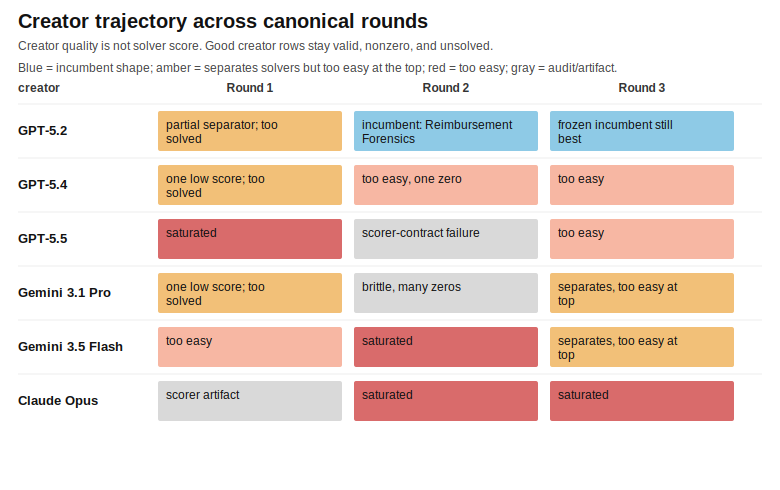

# Canonical BenchBench Results - 2026-05-23

Generated by `scripts/build_6x6_result_artifacts.py` from saved score JSONs.

This is the presentation layer. The raw experiment folders are unchanged.

The clean story has three canonical rounds:

1. Round 1: Experiment 003, reconstructed as a 6x6 grid by adding the Claude Opus creator row and solver column.
2. Round 2: Experiment 004, reconstructed the same way. This is where GPT-5.2 creates Reimbursement Forensics.
3. Round 3: Experiment 007 challengers, with GPT-5.2's frozen Reimbursement Forensics row carried forward as the incumbent.

That last step is deliberate. Raw Experiment 007 still contains GPT-5.2's Service Credit Forensics attempt, and it remains in the audit queue. But the canonical comparison asks whether any new challenger beat the frozen incumbent. None did.

## Current Answer

Reimbursement Forensics remains the best candidate so far. Its six-solver score profile is **10/30, 14/30, 11/30, 12/30, 11/30, 11/30**. That is the target shape: all solvers make progress, and no solver solves it.

It is frozen, not accepted. It still needs a human audit for leakage, answer evidence, scorer fairness, and external solvability before it can enter a stable benchmark bank.

Read each row as one creator's benchmark and each column as one solver's attempt. Cell values are exact-match correct out of 30.

Blue is the useful low-nonzero band. Orange and red mean the task was too easy. Gray zeros need audit before they count as hard; they can also mean an under-specified packet, scorer-contract failure, or operational failure.

## What Changed Across Rounds

The 6x6 grids are evidence, but they are not the easiest way to read the experiment. Creator quality and solver strength point in opposite directions: a good creator makes a valid task that keeps solvers low but nonzero; a good solver scores high.

| round | best creator read | solver read | what changed |
|---|---|---|---|
| Round 1 | No keeper | GPT-5.5 and Gemini 3.1 Pro both averaged 30/30 | First full grid proved most creator ideas were easy to solve. |
| Round 2 | GPT-5.2: Reimbursement Forensics | GPT-5.4 had the highest scored average, but artifacts make this a noisy solver contest | Feedback produced the first all-solver low-nonzero row. |
| Round 3 | GPT-5.2 frozen incumbent remains best | GPT-5.4 led the latest grid by total score | New challengers separated solvers but did not beat the incumbent. |

Current read:

- Best benchmark creator so far: GPT-5.2, because Reimbursement Forensics is the only all-solver low-nonzero candidate.
- Strongest latest solver: GPT-5.4 by Round 3 total score, though solver rankings are secondary here.
- Most interesting Round 3 challengers: Commercial Lease CAM and Maritime Freight, because they separated solvers without going all-zero. They were still too easy at the top end.

### Round 3 solver leaderboard

| solver | total | average | perfect | low | zero |
|---|---|---|---|---|---|
| GPT-5.4 | 147 | 24.5 | 2 | 1 | 0 |
| Claude Opus | 141 | 23.5 | 1 | 1 | 0 |
| Gemini 3.5 Flash | 134 | 22.3 | 0 | 1 | 0 |
| GPT-5.5 | 133 | 22.2 | 1 | 1 | 0 |
| Gemini 3.1 Pro | 127 | 21.2 | 1 | 1 | 0 |
| GPT-5.2 | 97 | 16.2 | 1 | 3 | 0 |

For solvers, higher is better. This table uses the canonical Round 3 grid, including the frozen GPT-5.2 incumbent row.

### Round 3 matchups

| benchmark | best solver | weakest solver | spread | read |
|---|---|---|---|---|
| Reimbursement Forensics | GPT-5.4 (14/30) | GPT-5.2 (10/30) | 4 | uniformly hard, audit pending |
| Catalog Royalty Forensics | GPT-5.4 (30/30) | Gemini 3.1 Pro, Claude Opus (25/30) | 5 | too easy |
| Prior Authorization Forensics | GPT-5.2 (25/30) | Gemini 3.1 Pro (23/30) | 2 | too easy |
| Commercial Lease CAM Reconciliation | GPT-5.4, GPT-5.5, Claude Opus (26/30) | GPT-5.2 (1/30) | 25 | separates solvers, too easy at the top |
| Maritime Freight & Customs Audit | Gemini 3.5 Flash, Claude Opus (25/30) | GPT-5.2 (4/30) | 21 | separates solvers, too easy at the top |
| Construction Progress Payment Certification | GPT-5.2, GPT-5.4, GPT-5.5, Gemini 3.1 Pro, Claude Opus (30/30) | Gemini 3.5 Flash (29/30) | 1 | saturated |

## Round 1 - First Full 6x6

| creator | benchmark | GPT-5.2 | GPT-5.4 | GPT-5.5 | Gemini 3.1 Pro | Gemini 3.5 Flash | Claude Opus |
|---|---|---:|---:|---:|---:|---:|---:|
| GPT-5.2 | Ledger Canonical Reconciliation | 11/30 | 30/30 | 30/30 | 30/30 | 30/30 | 11/30 |
| GPT-5.4 | Patchwork Ordinance Adjudication | 3/30 | 30/30 | 30/30 | 30/30 | 30/30 | 30/30 |
| GPT-5.5 | Amendment Ledger Reconciliation | 30/30 | 30/30 | 30/30 | 30/30 | 30/30 | 30/30 |
| Gemini 3.1 Pro | Polyhedral Surface Traversal | 30/30 | 6/30 | 30/30 | 30/30 | 30/30 | 30/30 |
| Gemini 3.5 Flash | Mutative Assembly Inversion | 30/30 | 30/30 | 30/30 | 30/30 | 22/30 | 30/30 |
| Claude Opus | String Rewriting Distance | 0/30 | 0/30 | 30/30 | 30/30 | 30/30 | 30/30 |

Notes:

- Every Round 1 row was solved perfectly by at least four solvers.
- Claude Opus's String Rewriting Distance row is not a keeper. GPT-5.2 and GPT-5.4 returned the right integer values as JSON strings, and the scorer rejected those type-mismatched answers.
- Ledger Canonical Reconciliation had a low Claude Opus score, but other solvers saturated it.

## Round 2 - Feedback Sweep

| creator | benchmark | GPT-5.2 | GPT-5.4 | GPT-5.5 | Gemini 3.1 Pro | Gemini 3.5 Flash | Claude Opus |
|---|---|---:|---:|---:|---:|---:|---:|
| GPT-5.2 | Reimbursement Forensics | 10/30 | 14/30 | 11/30 | 12/30 | 11/30 | 11/30 |
| GPT-5.4 | release_packet_arbitration | 27/30 | 25/30 | 27/30 | 0/30 | 27/30 | 25/30 |
| GPT-5.5 | Cross-Document Obligation Resolution | 0/30 | 0/30 | 0/30 | 0/30 | 0/30 | skip |
| Gemini 3.1 Pro | Corrupted LZ77 Recovery | 0/30 | 22/30 | 17/30 | 0/30 | 0/30 | 0/30 |
| Gemini 3.5 Flash | MFN-Cascade | 30/30 | 30/30 | 30/30 | 30/30 | 30/30 | 30/30 |
| Claude Opus | Conlang Rosetta | 30/30 | 30/30 | 30/30 | 30/30 | 30/30 | 30/30 |

Notes:

- Reimbursement Forensics is the first all-solver low-nonzero candidate.
- Cross-Document Obligation Resolution is marked `skip` for Claude Opus because the row was already audited as a scoring-contract failure.
- Corrupted LZ77 Recovery is diagnostic but narrow and operationally brittle.
- MFN-Cascade and Conlang Rosetta saturated.

## Round 3 - Challenger Sweep

| creator | benchmark | GPT-5.2 | GPT-5.4 | GPT-5.5 | Gemini 3.1 Pro | Gemini 3.5 Flash | Claude Opus |
|---|---|---:|---:|---:|---:|---:|---:|
| GPT-5.2 (frozen) | Reimbursement Forensics | 10/30 | 14/30 | 11/30 | 12/30 | 11/30 | 11/30 |
| GPT-5.4 | Catalog Royalty Forensics | 27/30 | 30/30 | 27/30 | 25/30 | 27/30 | 25/30 |
| GPT-5.5 | Prior Authorization Forensics | 25/30 | 24/30 | 24/30 | 23/30 | 24/30 | 24/30 |
| Gemini 3.1 Pro | Commercial Lease CAM Reconciliation | 1/30 | 26/30 | 26/30 | 16/30 | 18/30 | 26/30 |
| Gemini 3.5 Flash | Maritime Freight & Customs Audit | 4/30 | 23/30 | 15/30 | 21/30 | 25/30 | 25/30 |
| Claude Opus | Construction Progress Payment Certification | 30/30 | 30/30 | 30/30 | 30/30 | 29/30 | 30/30 |

Notes:

- GPT-5.2 is shown with its frozen Round 2 incumbent, not with the raw Service Credit Forensics row from Experiment 007.
- Service Credit Forensics remains a raw Experiment 007 audit item because it scored 0/30 for every solver.
- Maritime Freight and Commercial Lease CAM separated solvers, but both were too easy at the top end.
- Catalog Royalty, Prior Authorization, and Construction Progress Payment saturated.
